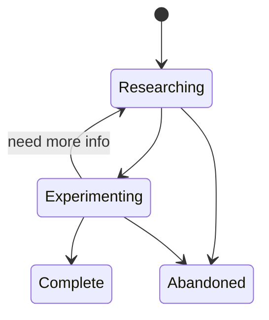
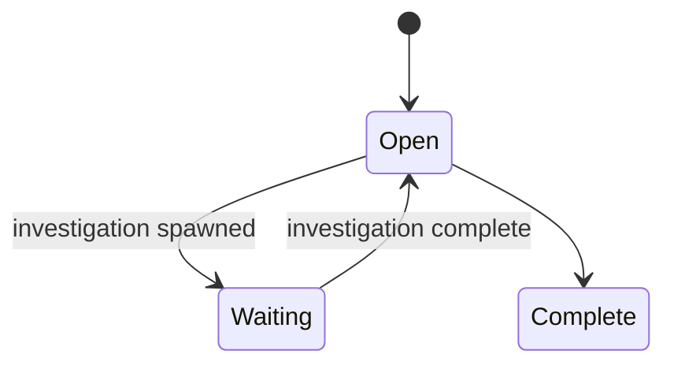

# The Apparatus

A process for making technical design decisions with tracked assumptions. When an assumption proves wrong, you can trace what's affected instead of starting over.

The process has two main activities: **investigating** questions and **designing** solutions. Investigations produce recommendations backed by research and experiments. Designs make decisions informed by those recommendations. Every decision records its assumptions with explicit conditions under which they'd be false.

## How It Works

1. A **Design** starts with a scope statement. Open questions are identified.
2. Questions that need answers spawn **Investigations**.
3. Each Investigation gathers **Research** and runs **Experiments** to produce a **Recommendation**.
4. Recommendations inform **Decisions** within the Design.
5. Each Decision documents its **assumptions** -- what it depends on being true, what would make it false, and what's affected if it is false.
6. When all decisions are resolved, the Design is complete.

## Investigation

An Investigation answers a technical question through structured research and experimentation.

### States



| State | Meaning |
|-------|---------|
| Researching | Gathering information, no experiments yet |
| Experimenting | Research sufficient to form hypotheses, running experiments |
| Complete | Recommendation produced |
| Abandoned | Question no longer relevant or not answerable (reason documented) |

### Structure

An Investigation has:

- **Question**: What you're trying to answer.
- **Evaluation Criteria**: What a successful answer looks like. Set at creation.
- **Recommendation**: The conclusion -- a statement of what to do and a confidence level (high: experiment passed; medium: experiment blocked; low: research only). Written when the Investigation completes. Must address all evaluation criteria.
- **Open Questions**: Questions that surfaced during work but are outside scope. Captured for future use; don't block completion.

### Frontmatter and file layout

```
investigations/<topic>/
  index.md
  research/
    001-<name>.md
    002-<name>.md
  experiments/
    001-<name>/
      index.md
      (experiment code)
```

**Investigation** (`investigations/<topic>/index.md`):

```yaml
apparatus:
  type: investigation
  status: researching | experimenting | complete | abandoned
  question: "The question being investigated"
  criteria:
    - "What a successful answer looks like"
  recommendation:          # only when status: complete
    statement: "What to do"
    confidence: high | medium | low
  open-questions:
    - "Question surfaced but not in scope"
```

**Research** (`research/NNN-<name>.md`):

```yaml
apparatus:
  type: research
  topic: "<parent-investigation-name>"
  id: NNN
```

**Experiment** (`experiments/NNN-<name>/index.md`):

```yaml
apparatus:
  type: experiment
  topic: "<parent-investigation-name>"
  id: NNN
  hypothesis: "The testable claim"
  status: planned | passed | failed | blocked
  result: "What was observed (when status is terminal)"
```

### Procedures

**Start an Investigation**

1. Create directory `investigations/<topic>/` with subdirectories `research/` and `experiments/`.
2. Create `index.md` with frontmatter: set `apparatus.type: investigation`, `apparatus.status: researching`, `apparatus.question`, and `apparatus.criteria`.
3. Write the body: restate the question and criteria in prose.

**Add Research**

1. Determine the next ID: count existing files in `research/`, add 1.
2. Create `research/NNN-<descriptive-name>.md` with frontmatter: set `apparatus.type: research`, `apparatus.topic`, and `apparatus.id`.
3. Write findings in the body. Cite sources.

**Add an Experiment**

1. Determine the next ID: count existing files in `experiments/`, add 1.
2. Create `experiments/NNN-<descriptive-name>/index.md` with frontmatter: set `apparatus.type: experiment`, `apparatus.topic`, `apparatus.id`, `apparatus.hypothesis`, and `apparatus.status: planned`.
3. Write the experiment setup in the body. Place any code in the same directory.

**Run an Experiment**

1. Execute the experiment as described in the experiment document.
2. Update `apparatus.status` to `passed`, `failed`, or `blocked`.
3. Write `apparatus.result` -- what was actually observed.
4. If the parent Investigation was in `researching`, update it to `experimenting`.

**Complete an Investigation**

1. Verify all evaluation criteria can be addressed by the evidence gathered.
2. Add `apparatus.recommendation` to the Investigation frontmatter with `statement` and `confidence`.
3. Add any `apparatus.open-questions` surfaced during work.
4. Update `apparatus.status` to `complete`.
5. Write the recommendation in the body, addressing each criterion.
6. If a parent Design is in `waiting` and no other spawned Investigations are active, update the Design to `open`.

**Abandon an Investigation**

1. Update `apparatus.status` to `abandoned`.
2. Document the reason in the body.
3. If a parent Design is in `waiting` and no other spawned Investigations are active, update the Design to `open`.

## Design

A Design creates an architecture or solution with explicit, tracked decisions.

### States



| State | Meaning |
|-------|---------|
| Open | Active work, accepting decisions and questions |
| Waiting | Cannot proceed until an investigation completes |
| Complete | All decisions resolved, document finalized |

### Structure

A Design has:

- **Scope Statement**: What is being designed and what is excluded. Set at creation.
- **Open Questions**: Questions requiring investigation or deferral. Each has a disposition: `investigate` (spawn an Investigation) or `defer` (record rationale, pick up later).

### Frontmatter and file layout

```
designs/<name>/
  index.md
  decisions/
    001-<name>.md
    002-<name>.md
```

**Design** (`designs/<name>/index.md`):

```yaml
apparatus:
  type: design
  status: open | waiting | complete
  scope: "What is being designed and what is excluded"
  open-questions:
    - question: "A question requiring investigation or deferral"
      disposition: investigate | defer
      rationale: "Why this disposition (required for defer)"
      investigation: "<topic-name> (when disposition: investigate)"
```

### Decision

A Decision chooses among options with documented rationale and tracked assumptions.

**States**: `open` (question identified) → `decided` (option chosen) → `superseded` (replaced by newer decision).

**Frontmatter** (`decisions/NNN-<name>.md`):

```yaml
apparatus:
  type: decision
  design: "<parent-design-name>"
  id: NNN
  status: open | decided | superseded
  superseded-by: "NNN (when status: superseded)"
  options:
    - name: "Option A"
      description: "What this option entails"
    - name: "Option B"
      description: "What this option entails"
  chosen: "Option A (when status: decided)"
  rationale: "Why this option was chosen"
  evidence:
    - type: investigation | research | experiment | external
      ref: "<path-or-description>"
  assumptions:
    - assumption: "Statement believed to be true"
      invalidation: "Observable condition that would make it false"
      impact: "What depends on this being true"
```

### Procedures

**Start a Design**

1. Create directory `designs/<name>/` with subdirectory `decisions/`.
2. Create `index.md` with frontmatter: set `apparatus.type: design`, `apparatus.status: open`, and `apparatus.scope`.
3. Write the body: scope statement, initial outline, any immediately apparent open questions.

**Identify Open Questions**

1. As questions arise, add them to `apparatus.open-questions` in the Design frontmatter.
2. For each, set `disposition`:
   - `investigate`: answer is unknown and the decision it informs is non-trivial. Set `investigation` to the topic name.
   - `defer`: answer is not needed for this Design to be complete. Set `rationale`.
3. For questions with disposition `investigate`, start an Investigation (see Investigation Procedures).
4. If an Investigation is spawned, update the Design's `apparatus.status` to `waiting`.

**Record a Decision**

1. Determine the next ID: count existing files in `decisions/`, add 1.
2. Create `decisions/NNN-<descriptive-name>.md` with frontmatter: set `apparatus.type: decision`, `apparatus.design`, `apparatus.id`, `apparatus.status: open`, and `apparatus.options`.
3. When ready to decide:
   - Set `apparatus.chosen` and `apparatus.rationale`.
   - Set `apparatus.evidence` -- what informed this decision.
   - Document `apparatus.assumptions`: for each assumption, record the statement, the condition that would make it false, and what depends on it being true.
   - Update `apparatus.status` to `decided`.
4. Write the rationale in the body.

**Complete a Design**

1. Verify all Decisions are `decided` (or `superseded` with replacement).
2. Verify all open questions have a Decision or explicit deferral.
3. Verify all assumptions are documented with invalidation conditions.
4. Update `apparatus.status` to `complete`.

**Supersede a Decision**

1. Create a new Decision document explaining the replacement.
2. Update the old Decision's `apparatus.status` to `superseded`.
3. Set `apparatus.superseded-by` to the new Decision's ID.

## Assumptions

The distinguishing feature of this process is that every Decision documents its assumptions with three parts:

1. **The assumption**: a statement believed true at decision time.
2. **Invalidation condition**: a concrete, observable condition that would make it false.
3. **Downstream impact**: what other artifacts depend on this being true.

When an assumption is found to be false, you identify the affected Decisions, assess whether the invalidation changes their conclusions, and create new Decisions where needed (the old ones become superseded).

Assumptions are not predictions. "The API will add feature X" is a prediction. "The API currently supports Y" is an assumption you can check.
